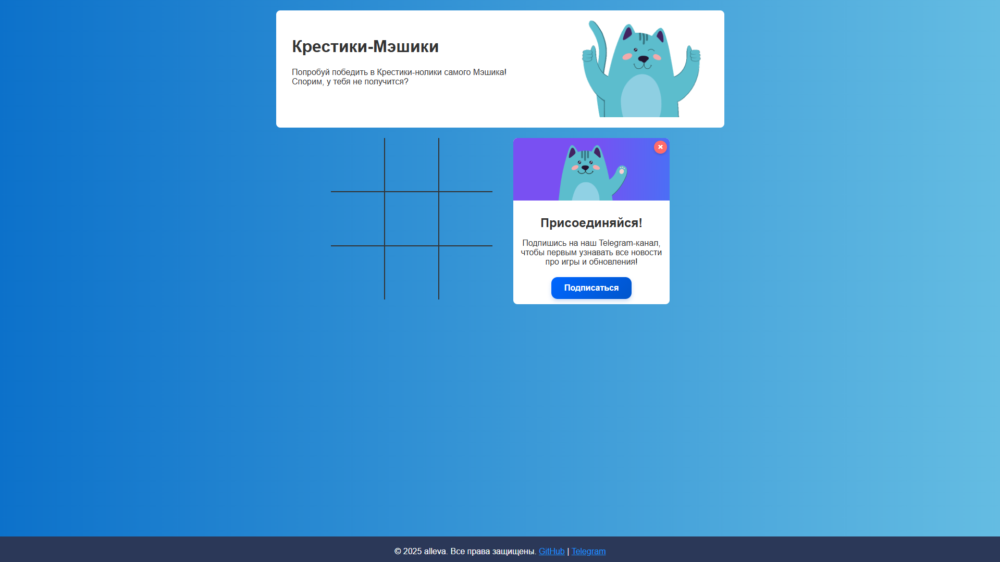

# Крестики-Мэшики

  
"Крестики-Мэшики" – это классическая игра в крестики-нолики с ИИ, где ваш противник - кот Мэшик из Московской электронной школы (МЭШ). Сможете ли вы победить великого Мэшика? Проверьте свои силы! Игра доступна на [GitHub Pages](https://allevalion.github.io/tic-tac-meshik/).

## Особенности

- Умный ИИ, использующий алгоритм минимакса для оптимальной игры
- Подсчет поражений и раскрытие секрета после ?? проигрышей
- Анимации победы, поражения и ничьи
- Адаптивный дизайн для всех устройств
- Промо-блок с Telegram-каналом (можно закрыть)
- Локальное хранилище для сохранения статистики

## Технологии

- HTML5, CSS3, JavaScript
- Алгоритм минимакса для ИИ
- CSS-анимации и переходы
- Адаптивный дизайн с медиа-запросами
- Локальное хранилище для сохранения счетчика поражений

## Установка

1. Клонируйте репозиторий:
   ```bash
   git clone https://github.com/allevalion/tic-tac-meshik.git
   ```
2. Откройте файл `index.html` в браузере.

Или играйте онлайн на [GitHub Pages](https://allevalion.github.io/tic-tac-meshik/).

## Как играть

1. Нажмите на любую свободную клетку, чтобы поставить крестик (X).
2. Мэшик автоматически поставит нолик (O) в ответ.
3. Попробуйте выиграть, создав линию из трех крестиков.
4. Если проиграете ?? раз, откроется секретная кнопка с объяснением алгоритма.

> [!IMPORTANT]
> ### Отказ от ответственности
> Автор данного проекта не имеет отношения к Московской электронной школе (МЭШ). Проект создан исключительно в <span style="text-decoration: underline;">образовательных</span> и развлекательных целях. В случае возникновения претензий со стороны владельцев/правообладателей МЭШ, я готов удалить проект <span style="text-decoration: underline;">по их требованию</span>.<br>
Для связи: [Telegram](https://t.me/llukyanov).